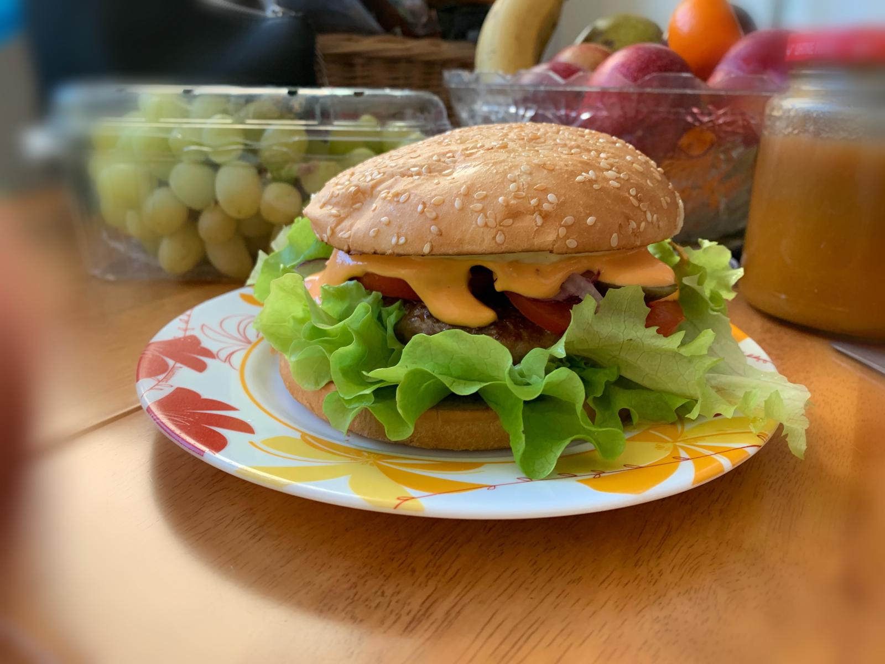

<!DOCTYPE html>
<html lang="eng">
<head>
<meta charset="utf-8" />
<title>mariakruglova.github.io</title>
</head>
<body>

<table
border="1"
align="center"
rules="rows"
style="width:60%;">

<tr>

<td>

<table
border="1"
background="slide1.jpg"
bgcolor="pink"
cellpadding="10"
style="width:100%; border-radius:5px;">

<tr>

<th>

<h1>Maria Kruglova</h1>
<h3><em>Love and be loved :) </em></h3>

</th>
</tr>
</table>

<table
border="1"
bgcolor="green"
cellpadding="10"
style="width:100%; border-radius:5px;">

<tr>

<td
rowspan="2"
style="width:80%">
<h2>Armastusega...</h2>

Tere. Minu nimi on Maria. Mu õel Aleksandral ja minul tekkis huvitav idee luua enda oma sait, et jagada Teiega meie igapäeva elu eredamaid ja õpetuslikke hetki. 

Praegu on antud sait tegemisel, kuid väga varsti täitub see huvitava sisuga. 

</td>

<td bgcolor="powderblue">
<h3>Sisu</h3>

<a href="">

<!--Название страницы
style="margin-left:5px;" - отступ названия от маркера-->
Minust</a>
<!--Закрываем абзац-->

<a href="">

Rasedus ja sünnitus</span;></a>

<a href="">

Sport ja toitumine</a>

<!--Закрываем строку Меню-->
</td>
</tr>
<!--Создаём строку с дополнительной информацией-->
<tr>
<!--Ячейка с дополнительной информацией-->
<td
bgcolor="blue"
align="center">
<h3>Kontakt:</h3>

maria@mail.ee

<!--Закрываем ячейку с общей информацией
и таблицу основного контента-->
</td>
</tr>
</table>

<!--ПОДВАЛ-->

<!--Создаём таблицу подвала-->
<table
border="1"
bgcolor="red"
height="100"
cellpadding="10"
style="width:100%; border-radius:5px;">
<!--Создаём строку.-->
<tr>
<!--Создаём столбец-->
<th>
<h3>Täiendamisel</h3>
<!--Закрываем таблицу подвала. При желании в подвале можно
сделать несколько строк и столбцов-->
</th>
</tr>
</table>
<!--Закрываем таблицу контейнера-->
</td>
</tr>
</table>
</body>
</html>
